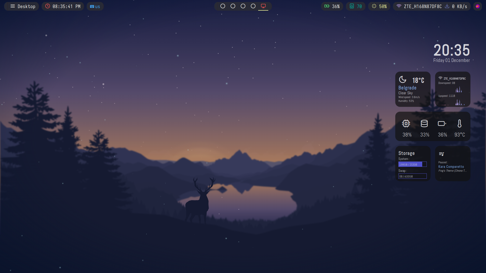

# archibald dotfiles

Repository containing current Arch/i3 dotfiles
 
 

## Details
- WM - [i3-gaps](https://github.com/Airblader/i3)
- Compositor: [picom (ibhagwan's fork)](https://github.com/ibhagwan/picom)
- Terminal: Alacritty
- Prompt: Starship
- Launcher: [Rofi](https://github.com/Davatorium/rofi)
- Status Bar: polybar
- Fetch: neofetch
- Text Editor: VS Code
- GTK Theme: [Orchis-Dark](https://www.gnome-look.org/p/1357889/)
- File Manager: Thunar
- Grub Theme: [CRT-Amber](https://www.pling.com/p/1727268/)
- Fonts/Icons: JetBrains Mono Nerd, Iosevka Nerd, Bebas Neue, Material Icons
- Process Viewer: htop
- Desktop Widgets: conky
- Display Manager: LightDM

## Showcase

|    |    |
|:-------:|:-------:|
|||
|**neofetch**|**VS Code**|
|    |    |
|||
|**Rofi**|**Thunar**|
|    |    |
|||
|**Multi-window**|**htop**|
